<h1 align="center">Nuvabill</h1>

<p align="center">
  <strong>The free, open-source WHMCS alternative for hosting companies.<br>Billing, automation and support. Built for phones first.</strong>
</p>

<p align="center">
  <a href="https://github.com/meroxis/nuvabill/actions/workflows/tests.yml"></a>
  <a href="LICENSE"></a>
  
  <a href="https://github.com/sponsors/meroxis"></a>
</p>

<p align="center">
  <a href="https://nuvabill.com">Website</a> ·
  <a href="https://demo.nuvabill.com/admin/login">Live demo</a> ·
  <a href="#getting-started">Getting started</a> ·
  <a href="#whats-in-nuvabill">Features</a> ·
  <a href="#why-nuvabill-instead-of-whmcs">Nuvabill vs WHMCS</a> ·
  <a href="docs/README.md">Docs</a> ·
  <a href="ROADMAP.md">Roadmap</a>
</p>

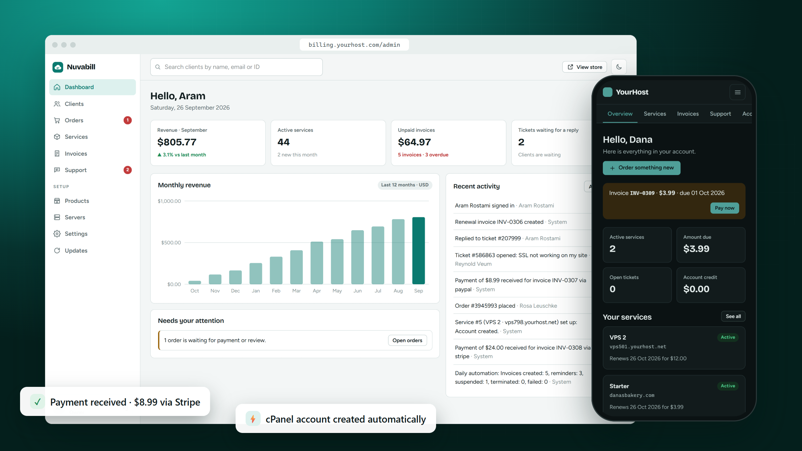

**Nuvabill is free, open-source billing software for web hosting companies**, written from scratch as a modern
alternative to WHMCS. It sells your hosting plans and domains, bills clients every month, creates their cPanel,
DirectAdmin, Plesk, Proxmox or Virtualizor accounts the moment they pay, suspends late payers, and handles support
tickets. It is licensed under the AGPL: there is **no license fee and no per-client pricing**, and moving from WHMCS
takes one import.

### At a glance

- **Automation**: cPanel & WHM, DirectAdmin, Plesk, Proxmox VE and Virtualizor accounts created on payment, suspended when overdue, unsuspended when paid, plus free CyberPanel, HestiaCP, VirtFusion and SolusVM modules on the Marketplace
- **Automations**: "when this happens, do that", like late fees, welcome emails, quote follow-ups and VIP tickets first, with 9 templates and a log of every run
- **AI help** with your own Claude key: ticket reply drafts, two-way ticket translation, summaries and product texts; staff always send, and private details never reach the AI
- **Telegram and WhatsApp**: invoices, reminders and ticket replies in the chat apps clients already use; clients link by QR code, and chats become tickets
- **Admin phone app**: install the admin area on your phone from the browser, with a Today screen and push alerts for orders, payments and tickets
- **Billing**: invoices with PDFs, renewals, reminders, taxes (VAT, GST, sales tax), coupons, product add-ons, quotes, a client wallet and affiliates
- **Payments**: Stripe, PayPal, bank transfer and Iraqi payments (FIB, FastPay and Wayl), with refunds and exchange rates
- **Domains**: search, register, transfer and renew at ResellerClub, Namecheap, Enom or OpenSRS
- **Support**: tickets with departments, priorities and email notifications
- **Security**: two-factor sign-in, passkeys, CAPTCHA, fraud checks, staff roles, security headers
- **10 languages**, with right-to-left Arabic and Kurdish (Sorani)
- **Search engines**: sitemap, titles and descriptions, prices on Google, language links and link previews, with every theme
- **REST API**, a **marketplace** of signed themes and extensions, and **signed one-click updates** with rollback
- **Importers for WHMCS, Blesta, FOSSBilling and Paymenter**: clients (with their passwords), products, services, domains, invoices, payments and tickets, with a dry run first

**Install it with a single command:**

```
curl -fsSL https://nuvabill.com/install.sh | bash
```

> **Status: v0.5.** New: the **admin phone app** with push alerts, **Telegram and WhatsApp** (invoices, reminders and tickets in chat apps, linked by QR code), **AI help** with your own Claude key (reply drafts, tickets in two languages, summaries) and **Automations**, "when this happens, do that", with 9 ready-made templates. Also taxes, a client wallet, quotes, affiliates, a REST API, passkeys, and 10 languages with right-to-left pages for Arabic and Kurdish. See the [roadmap](#roadmap).
>
> **Try it:** the [live demo](https://demo.nuvabill.com/admin/login) has sample clients, invoices and tickets. One click signs you in, and the data resets every hour.

---

## Why Nuvabill instead of WHMCS

| | Nuvabill | WHMCS |
|---|---|---|
| Cost | Free, no per-client pricing | Paid license; check the vendor's site for current prices |
| Source code | Open (AGPL-3.0): read it, change it, host it anywhere | Closed; the core needs the ionCube Loader |
| Moving over | Built-in importers for [WHMCS](docs/whmcs-migration.md), [Blesta, FOSSBilling and Paymenter](docs/importing.md), with a dry run; run them as often as you like before you switch | — |
| Updates | Signed releases, one-click update with backup and automatic rollback | See the vendor's documentation |
| Iraqi payments | FIB, FastPay and Wayl built in; prices in dollars, payment in dinar | Check the vendor's marketplace |
| Right to left | Arabic and Kurdish (Sorani) client and admin areas | Check the vendor's site |

**When WHMCS may still be the better choice today.** Nuvabill is young (first release: September 2026). Stay with
WHMCS, or wait, if you depend on:

- a module or integration Nuvabill does not have yet (WHMCS has a large third-party ecosystem)
- a long track record and a commercial support contract

These gaps are on the [roadmap](ROADMAP.md).

## Screenshots

<table>
  <tr>
    <td>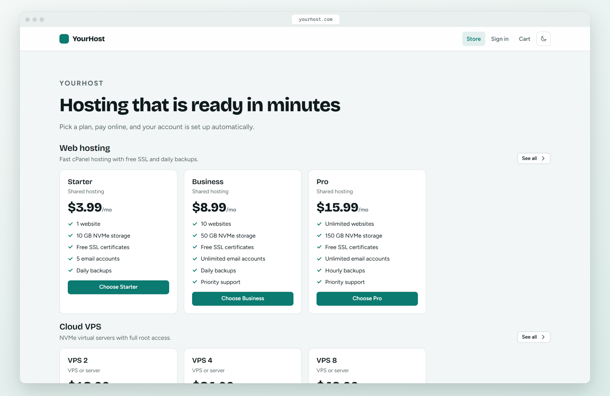</td>
    <td>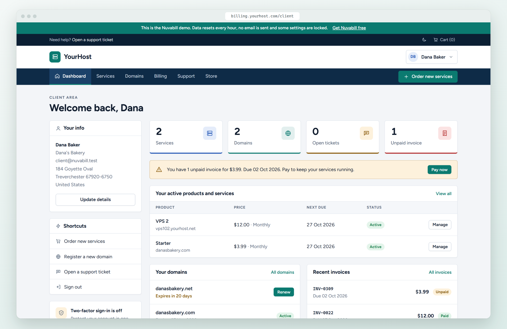</td>
  </tr>
  <tr>
    <td>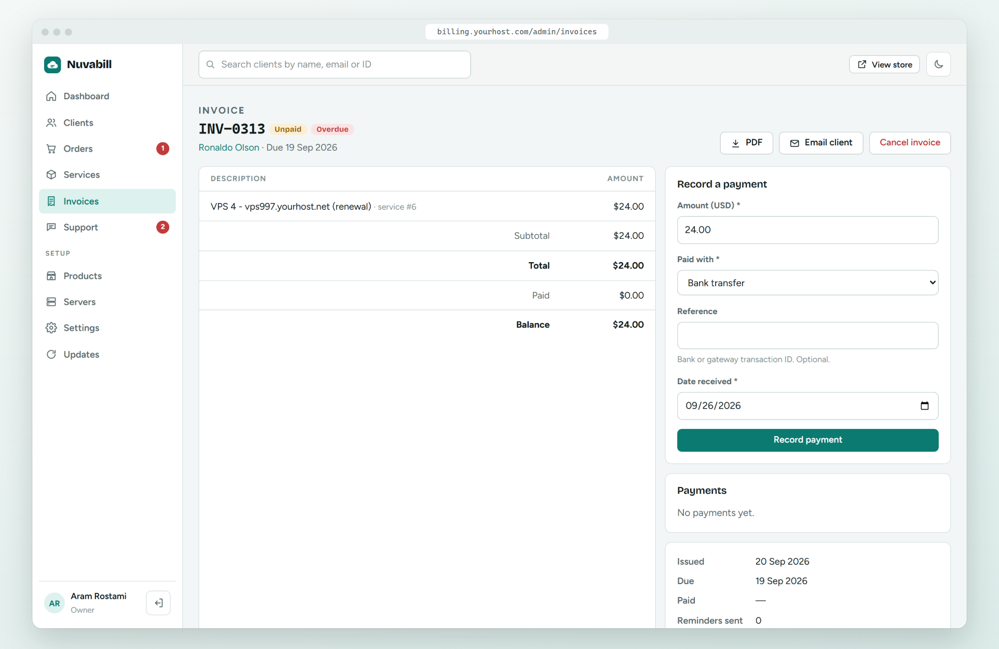</td>
    <td>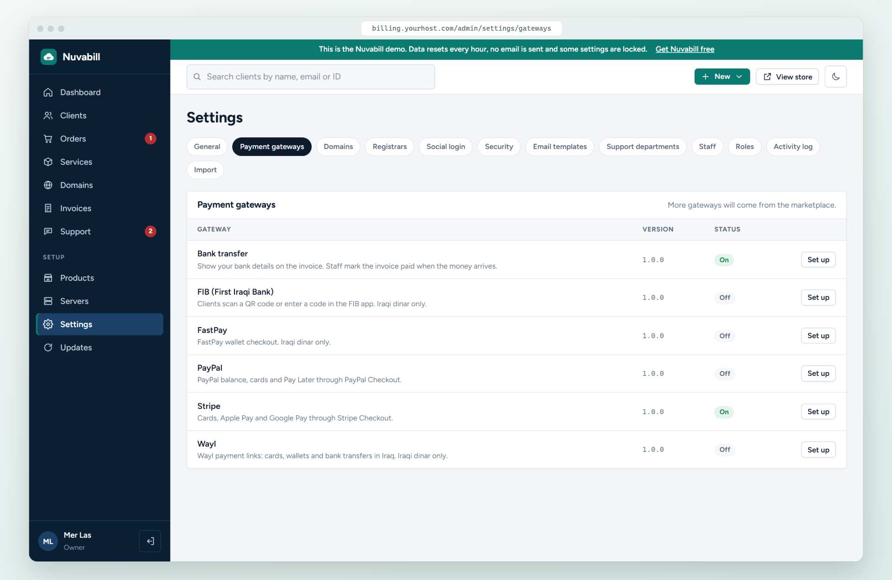</td>
  </tr>
  <tr>
    <td>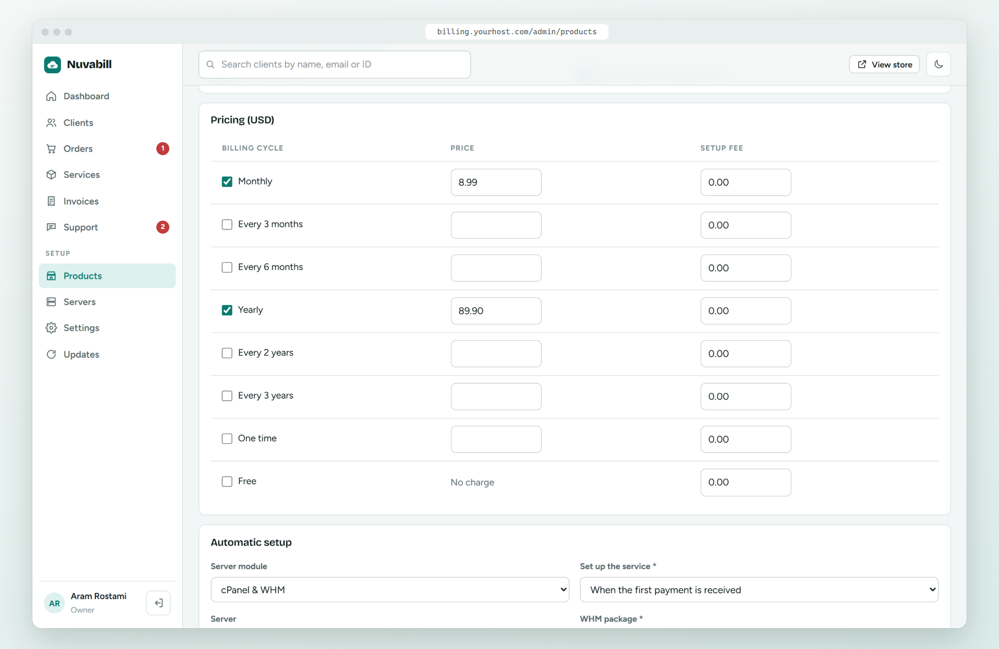</td>
    <td>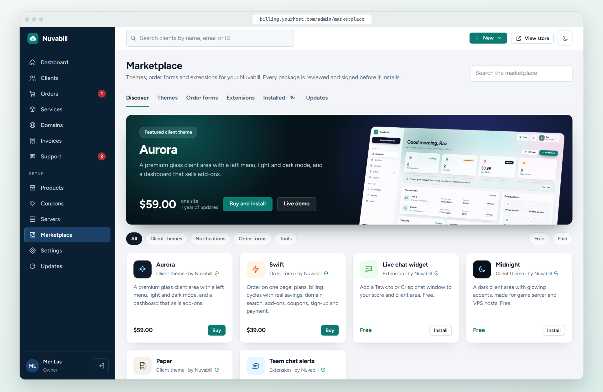</td>
  </tr>
</table>

More below, and in the [live demo](https://demo.nuvabill.com/admin/login).

---

## Getting started

Step-by-step guides are in the [documentation](docs/README.md): [installation](docs/installation.md),
[configuration](docs/configuration.md), [control panels](docs/integrations/servers.md),
[payment gateways](docs/integrations/payment-gateways.md), [registrars](docs/integrations/domain-registrars.md),
[migrating from WHMCS](docs/whmcs-migration.md) and the [FAQ](docs/faq.md).

### Install with one line

On a **fresh Ubuntu 22.04/24.04 or Debian 12/13 server**, as root:

```
curl -fsSL https://nuvabill.com/install.sh | bash
```

It sets up Nginx, PHP 8.4, MariaDB, a free SSL certificate and the cron job, then asks for your company name and
your owner account. Give your address up front with `bash -s -- --domain billing.yourhost.com`.

On a server that **already runs PHP 8.3+** (SSH, or **Terminal** in cPanel), the same line installs Nuvabill into a
`nuvabill` folder, asks a few questions and adds the cron job. Choose the folder with `--dir`. Every download is
checked against the release signature before anything is unpacked.

Already unpacked Nuvabill yourself? Run `php artisan nuvabill:install` in its folder to install from the terminal
instead of the browser.

Prefer to upload a zip? Follow the steps below.

### 1. Check your hosting

- PHP **8.3 or newer** with `pdo`, `openssl`, `mbstring`, `intl`, `curl`, `zip`, `sodium`, `bcmath`, `fileinfo`
- **MySQL 8** or **MariaDB 10.6+** (SQLite works for small sites and testing)
- A **cron job** that runs every minute

Most cPanel, DirectAdmin and Plesk hosting accounts already have all of this.

### 2. Upload and install

1. Download `nuvabill-x.y.z.zip` from the [latest release](https://github.com/meroxis/nuvabill/releases/latest).
2. Upload it to your hosting account and unzip it. Point your domain or subdomain (for example `billing.yourhost.com`) to the `public` folder.
3. Create an empty MySQL database and user in your hosting panel.
4. Open your domain in a browser. The installer checks your server, connects the database and creates your owner account.

Using **Cloudflare**? Add `NUVABILL_TRUSTED_PROXIES=cloudflare` to `.env`, so sign-in limits and logs see your visitors' real IP addresses.

### 3. Turn on automation

Add this cron job (cPanel → **Cron Jobs**). The exact line for your server is shown in **Settings → Automation**.

```
* * * * * cd /path/to/nuvabill && php artisan schedule:run >> /dev/null 2>&1
```

It creates renewal invoices, sends reminders, suspends overdue services, sends email and installs updates.

### 4. Connect your business

In the admin area (`/admin`):

1. **Servers** → add your cPanel/WHM, DirectAdmin, Plesk, Proxmox or Virtualizor server and press **Test connection**.
2. **Products** → create your plans (or edit the example plans) and choose the package or VPS plan for each.
3. **Settings → Domains** and **Registrars** → set your domain prices and connect ResellerClub, Namecheap, Enom or OpenSRS.
4. **Setup → Extensions** → turn on Stripe, PayPal, FIB, FastPay, Wayl or bank transfer.
5. **Settings → Sending email** → add your SMTP details and send yourself a test email.
6. **Settings → Security** → choose two-factor rules and CAPTCHA. Then turn on two-factor login on **Your profile**.

Moving from WHMCS, Blesta, FOSSBilling or Paymenter? **Settings → Import** first shows a dry run, then copies your
clients (with their passwords), products, services, domains, invoices and tickets. You can run it again before you
switch; it never makes copies.

That's it. Your store is live at your domain.

---

## What's in Nuvabill

### A store your clients enjoy

Plans with monthly to three-yearly prices, setup fees, a domain field, cart and checkout. Clients register in one step,
or with **Google, GitHub or Facebook**.

- **Coupons**: percent or fixed, for the first payment, every payment or a number of payments, limited by product,
  billing cycle, dates, uses and new clients. Share a link like `yourhost.com/?coupon=WELCOME20` and it is applied for the client.
- **Product add-ons** such as backups, a dedicated IP or priority support, billed and renewed with the service.
- Want everything on one page? The **Swift** order form in the marketplace puts plans, domain search, add-ons, coupons,
  sign-up and payment on one screen.


### A professional client area

Clients see everything at a glance: their services, domains that expire soon, unpaid invoices and support tickets,
with shortcuts and their account details on the side. The menu bar and colours follow your brand.


### Built for phones first

The whole client area works on a phone: services, invoices, payments, tickets and account details. Light and dark mode follow the device.

Staff can install the **admin area as an app** on their phone from the browser, no app store needed. It opens on a
**Today** screen with the day's orders, payments and tickets, and sends **push alerts** for new orders, payments and
tickets. See the [phone app guide](docs/phone-app.md).

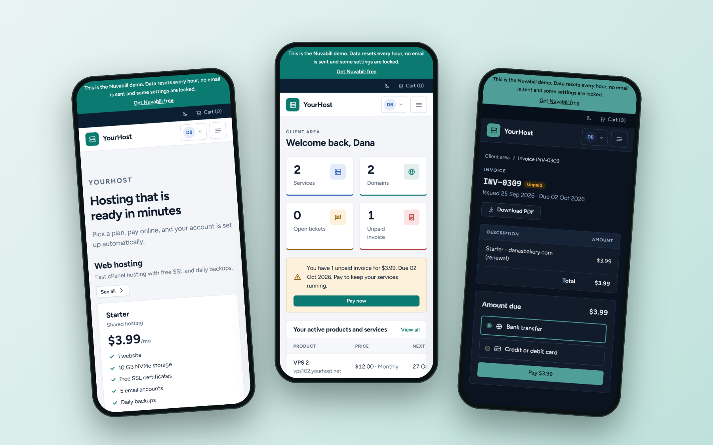

### Billing that runs itself

- Invoices with PDF download, partial payments, drafts and manual invoices
- Renewal invoices created before the due date, grouped per client
- Overdue reminders, automatic suspension, optional termination
- **Paying unsuspends automatically**
- **Automatic payments**: clients save a card or PayPal account and renewals are charged by themselves, wallet first, with retries and notices ([guide](docs/automatic-payments.md))
- **Taxes**: VAT, GST or sales tax by country and state, prices with or without tax, tax-exempt clients, and tax numbers on invoices
- **Client wallet**: clients add funds and pay invoices with one click; overpayments and refunds land there too


### Automations: when this happens, do that

Pick what starts it (an invoice is overdue, a client signs up, a client opens a ticket, a domain expires soon, and
nine more), add conditions like "the client does not have the tag VIP", then the steps: email the client or staff, add
a late fee, add wallet credit, tag the client, open or assign a ticket, suspend a service, send the details to a web
address, wait, and only go on if something is still true. Start from **9 templates**, **Try it** on a real invoice
before you switch it on, and see every run in the log. A waiting run stops by itself when the invoice was paid in
the meantime. See the [automations guide](docs/automations.md).

### Quotes and affiliates

Send a **quote** for custom work, like a dedicated server or a migration. The client accepts it in their account and
the invoice is created for them. The **affiliate program** gives every client a link: when someone they send pays,
they earn a commission that moves to their wallet after the refund window.

### Domains

Clients search for a domain, see the price, and order it on its own or with a hosting plan. Nuvabill registers,
transfers and renews it at **ResellerClub, Namecheap, Enom or OpenSRS**, sends expiry reminders, and lets clients
change nameservers. Without a registrar, availability comes from free RDAP lookups.

### Get paid your way

**Stripe Checkout**, **PayPal Checkout** and **bank transfer** are built in, with refunds from the invoice page.
For Iraq: **FIB** (First Iraqi Bank, with QR code), **FastPay** and **Wayl**. Card numbers never touch your server.
Show prices in US dollars and charge in Iraqi dinar at **the exchange rate you set** (Settings → Currencies);
the invoice stays in dollars and is marked paid in full.
Webhooks are signature-checked, and each payment is recorded exactly once.


### Control panel and VPS automation

**cPanel & WHM, DirectAdmin and Plesk** accounts are created when the first invoice is paid. Suspend, unsuspend,
terminate and change package from the admin area. Clients open their control panel with one click, no password needed.

**Virtualizor and Proxmox VE** virtual servers are managed **inside the client area**, like in WHMCS: start, stop,
restart, live usage, IP addresses and root password, plus hostname, OS reinstall and VNC details on Virtualizor.
API keys stay on your server.

Free on the Marketplace: **CyberPanel** and **HestiaCP** hosting, and **VirtFusion** and **SolusVM** virtual servers
with power controls in the client area. Install one with a click and it shows up next to the built-in modules.


### Support tickets

Departments, priorities, assign a ticket to a staff member, email notifications for clients and staff, and a clean
conversation view.

**AI help** (with your own Anthropic key): **Write a draft** gives you a reply from the whole ticket and the client's
account, which you make shorter, friendlier or more detailed, and always check and send yourself. Messages in other
languages are translated for your team, and your reply can go out in the client's language after you check the
translation. There is an AI summary with a suggested department and priority, and **Write with AI** on product pages.
Passwords, card details, email addresses and phone numbers never reach the AI, and a monthly limit keeps spending in
check. See the [AI help guide](docs/ai-help.md).

**Telegram and WhatsApp**: clients scan a QR code in the client area to get invoices, reminders and ticket replies in
their chat app, and can write to support from there; their messages become tickets and your answers go back to the
chat. Connect WhatsApp by scanning a QR code with the WhatsApp Business app, and get staff alerts in your team's
Telegram group. See the [Telegram and WhatsApp guide](docs/chat-apps.md).

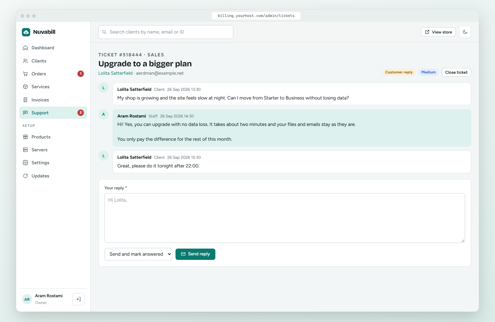

### A dashboard that tells you what matters

Revenue for the last 12 months, unpaid invoices, tickets waiting for a reply, and a **Needs your attention** list:
failed setups, pending orders, overdue invoices, and a warning if the cron job stops running.

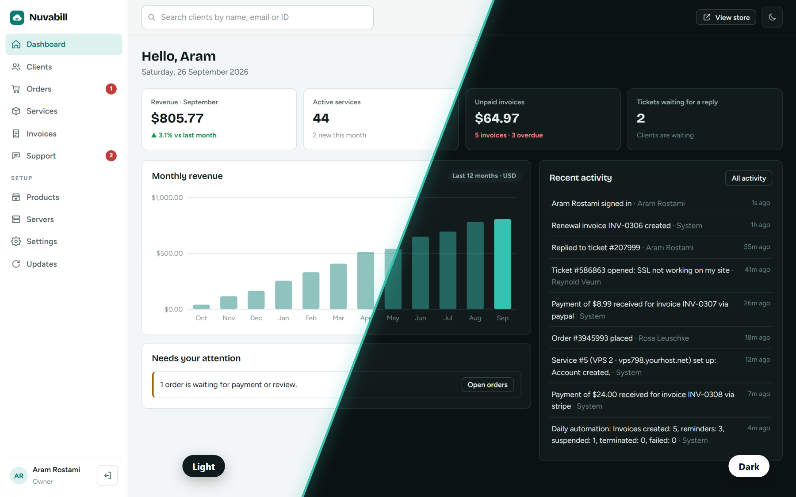

### Clients, staff and security

- Client profiles with services, invoices, payments, tickets and activity in one place
- Staff **roles and permissions** (Owner, Billing, Support, or your own)
- **Passkeys**: sign in with a fingerprint, face or phone, which fake sign-in pages cannot steal
- **Two-factor sign-in** for staff and clients: an authenticator app with recovery codes, or codes by email. Make it optional or required.
- **CAPTCHA** (Cloudflare Turnstile, reCAPTCHA or hCaptcha) on the forms you choose
- **Fraud checks** on new orders: throwaway email addresses, too many orders from one IP, and country mismatch
- **Sign in with Google, GitHub or Facebook**
- Activity log of everything that happens
- Security headers on every page (content security policy, no framing, strict HTTPS) and a safe setup for Cloudflare

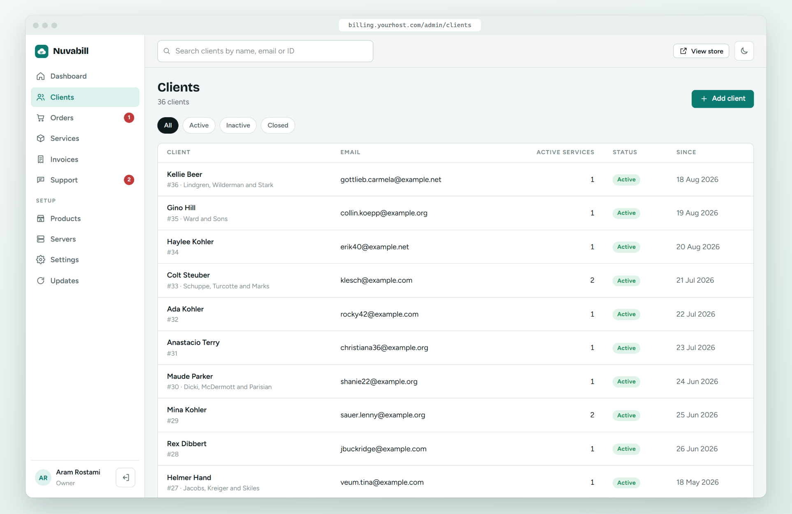

### Site health: security, database and search engine checks

Every night, and after every update, Nuvabill checks itself and gives the site a score: staff without two-factor
sign-in, a `.env` file other accounts can read, folders anyone can change, backups left in the public folder,
private files that strangers can open, debug mode, gateways left in test mode, and much more. A signed list of
Nuvabill's own files shows changed files and unknown code where visitors can run it. Many problems have a
**Fix it** button, and staff get an email about new urgent issues.

The database tab checks who can reach the database, whether secrets in it are encrypted and whether tables are
healthy, and optimizes tables and cleans up old logs with one click (after a backup). From the terminal:
`php artisan nuvabill:security-check` exits with code 1 while an urgent issue is open.

Renewals are safe to run twice: each billing period can only be invoiced once, enforced by the database.

### Found on Google

Every store page gets a title and description for search results, one address, and links to its other language
versions. **sitemap.xml** and **robots.txt** are made for you, product pages show their price and stock on Google,
and links shared on WhatsApp, Facebook and X show a preview with your share image. Products and groups have a
**Search appearance** box with a Google preview; changing a web address forwards the old one. The **Search engines**
tab in Site health checks it all every night. See the [search engines guide](docs/search-engines.md).

### 10 languages

The whole client area and admin area speak **10 languages**, the most used in the world plus Kurdish: English,
Chinese (Simplified), Spanish, French, Arabic, Portuguese (Brazil), Russian, German, Turkish and Kurdish (Sorani).
Arabic and Kurdish pages read **right to left**.
Clients and staff pick their language from a searchable menu in the top bar; you choose the default and which
languages clients can pick in **Settings → General**.

### REST API

Connect your own tools with the API at `/api/v1`: clients, services (suspend, unsuspend, terminate), invoices and
payments, products, orders and tickets. Staff make keys under **Your profile → API keys**; a key can do what their
role allows, and can be read-only.

```
curl -H "Authorization: Bearer nb_…" https://billing.yourhost.com/api/v1/invoices?status=unpaid
```

See the [API guide](https://nuvabill.com/docs/api/).

### Signed one-click updates

Nuvabill checks for new versions every day. Every release is **signed**: the updater refuses anything with a wrong signature,
backs up your files and database first, and **rolls back automatically** if something fails.
Security fixes can install themselves at night.

**Backups** of the whole site, or of the database only, with `php artisan nuvabill:backup` (add `--password` to encrypt
them). The free **Google Drive backup** add-on on the Marketplace runs them on a schedule and keeps the newest copies.

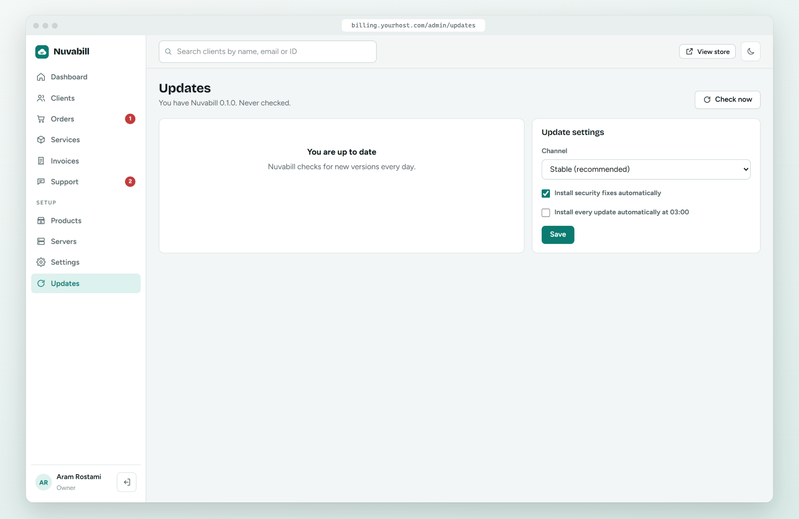

### Marketplace: themes, order forms and add-ons

Open **Marketplace** in the admin area to browse themes, order forms, gateways and add-ons, and **install them with one click**.
Try a theme on your own site first with **Live preview**, which only you see.

- Every package is **reviewed by people** and **signed**. Nuvabill refuses anything that was changed after signing.
- Before you install, you see in plain words what a package can do, for example "Connects to api.telegram.org".
- Paid items come with a license key for one site. Test sites (`localhost`, `*.test`, `staging.*`, `dev.*`) are always free.
- Updates show on the Marketplace page and install with one click.
- **Extensions** (under Setup) lists every payment gateway, server module, registrar and add-on you have, whether it is
  on, how much it is used and whether it still needs settings. Switch them on and off right from the list. It also
  shows which ones were copied onto the server by hand, and moves unused ones to quarantine with one click.

Free to start: the **Paper** and **Midnight** themes, **Team chat alerts** (orders, payments and tickets in Telegram or Discord)
and a **Live chat widget** (Tawk.to or Crisp). Premium: the **Aurora** client area and the **Swift** one-page order form.

**Developers** can sell their own themes and extensions on [my.nuvabill.com](https://my.nuvabill.com/developers).
You keep **83%** of every sale. See the [developer guide](https://nuvabill.com/docs/developers/).


---

## License

Nuvabill is free software under the **[GNU Affero General Public License v3.0 or later](LICENSE)**, with one additional term:
the **"Powered by Nuvabill"** credit in the client area, invoices and emails must stay visible. See [NOTICE](NOTICE).

**Want only your own brand?** A **[White-label License](https://my.nuvabill.com/white-label)** removes the credit
from your client area, invoices and emails, and adds priority support. Enter the key under **Settings → License**.

Copyright © 2026 RapidNet Ltd. Nuvabill is a product of RapidNet Ltd.

---

## Roadmap

| Version | Focus |
|---|---|
| v0.1–v0.4 | Done: billing, cPanel/DirectAdmin/Plesk/Proxmox/Virtualizor (plus free CyberPanel, HestiaCP, VirtFusion and SolusVM modules), domains, Iraqi payments, importers for **WHMCS, Blesta, FOSSBilling and Paymenter** with a dry run, marketplace, taxes, wallet, affiliates, REST API, passkeys, languages with right-to-left pages, search engine tools, Site health ([changelog](CHANGELOG.md)) |
| v0.5.0–v0.5.6 | Done: **Automations** with 9 templates, client tags and ticket assignment; **AI help** with your own Claude key; **Telegram and WhatsApp**; the **admin phone app** with push alerts |
| v0.6.0–v0.6.8 | Done: **Automatic payments** with saved cards and PayPal accounts; a **Settings** home with grouped cards and search; your own icon with a White-label License; **upgrades and downgrades** with a fair price for the days left; emails and PDF invoices in each client's language; a **knowledge base**, announcements and a **network status page** with server checks; **credit notes**, CSV exports and **privacy tools**; add-ons that show your **company website**; 10 languages |
| **next** | The path to 1.0: security audit, more integrations, SMS ([ROADMAP.md](ROADMAP.md)) |
| v1.0 | Security audit, and more |

The full plan, including what we think is still missing before 1.0, is in [ROADMAP.md](ROADMAP.md).

## Updating

Go to **Updates** in the admin area and press **Update now**, or let updates install automatically.
From the command line: `php artisan nuvabill:update`.

## For developers

```
git clone https://github.com/meroxis/nuvabill.git
cd nuvabill
composer install
npm install && npm run build
cp .env.example .env
php artisan key:generate
```

Set `NUVABILL_INSTALLED=true` and `APP_ENV=local` in `.env`, then load the demo data and start the server:

```
php artisan migrate:fresh --seed
php artisan serve
```

Demo sign-ins: staff `admin@nuvabill.test`, client `client@nuvabill.test`, both with password `nuvabill-demo`.

Run the tests and the code style check with `php artisan test` and `vendor/bin/pint`.

<details>
<summary><strong>Writing an extension</strong></summary>

An extension is a folder with an `extension.json` manifest and PHP classes in `src/`:

```
extensions/gateways/mygateway/
├── extension.json
└── src/MyGateway.php
```

```json
{
    "slug": "mygateway",
    "type": "gateway",
    "name": "My Gateway",
    "version": "1.0.0",
    "namespace": "Acme\\MyGateway\\",
    "class": "Acme\\MyGateway\\MyGateway",
    "requires": ">=0.1.0"
}
```

Payment gateways extend `App\Extensions\Gateways\Gateway`. Server modules extend `App\Extensions\Servers\Module`.

**Add-ons** (`"type": "addon"`, in `extensions/addons/`) extend `App\Extensions\Addons\Addon`. In `boot()` they can
listen to `OrderPlaced`, `InvoicePaid`, `ServiceActivated`, `TicketOpened` and `TicketReplied` (in `App\Events`),
add HTML to page heads with `headHtml()` and allow extra hosts with `contentSecurityPolicy()`. Since 0.4.2 they can
also run on a schedule (`schedule()`), add admin pages under `/admin/addons/{slug}/` (`adminRoutes()`), show a panel on
their settings page (`settingsHtml()`), keep their own values with `remember()`, and ship `lang/ar.json` and
`lang/ckb.json` translations. `App\Support\SiteBackup` makes whole-site or database backups for backup add-ons.

List what your package does in `"permissions"`, for example `["events", "http:api.example.com"]`. Staff see it before installing.
</details>

<details>
<summary><strong>Selling on the marketplace</strong></summary>

1. Create a client account on [my.nuvabill.com](https://my.nuvabill.com) and open **Developers → Join**.
2. Upload your package zip. Automatic checks run first, then our team reviews the code.
3. When it is approved, the store signs it and it appears in every Nuvabill admin area.

You set the price and the yearly update price. You keep 83% of each sale, and we pay out monthly.
Read the full [developer guide](https://nuvabill.com/docs/developers/).
</details>

<details>
<summary><strong>Writing a theme</strong></summary>

Copy `themes/nova` to `themes/yourtheme`, change `theme.json`, and edit the views. Any view your theme does not include
falls back to Nova. Choose the theme in **Settings → Look and feel**.
</details>

<details>
<summary><strong>Releasing (maintainers)</strong></summary>

1. Set the new version in `config/nuvabill.php`.
2. Add a `## x.y.z` section to `CHANGELOG.md` in plain words. Site owners see it on their **Updates** page.
3. Commit, then push a tag with the same version: `git tag v0.1.1 && git push origin v0.1.1`.
4. The release workflow builds the zip, signs it with the `NUVABILL_SIGNING_KEY` secret and publishes the GitHub release with that section as its notes.
5. For security releases, add `[security]` to the section so installs can apply them automatically.

The public half of the signing key is in `config/nuvabill.php`. Never commit the secret half.
</details>

## Support Nuvabill

Nuvabill is free. If it helps your business, please support its development on
[GitHub Sponsors](https://github.com/sponsors/meroxis). Sponsors keep new features and security updates coming.

## Contributing

Bug reports, translations and pull requests are welcome: see [CONTRIBUTING.md](CONTRIBUTING.md). By sending a pull
request you agree that your contribution may be distributed by RapidNet Ltd under the AGPL-3.0 license and under the
Nuvabill commercial White-label License.

## Security

Found a security problem? Please report it privately, not in a public issue: use **Report a vulnerability** on the
[Security tab](https://github.com/meroxis/nuvabill/security) or email [security@nuvabill.com](mailto:security@nuvabill.com).
See [SECURITY.md](SECURITY.md).
